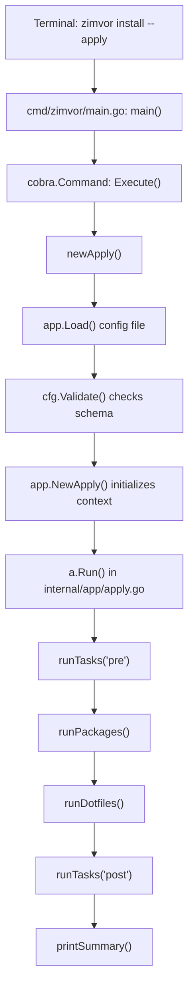

# Learning Go through Zimvor (Python Developer's Guide)

Welcome! This guide is designed for an experienced Python developer transitioning to Go. It maps out a structured learning path using this codebase and highlights the key differences, gotchas, and mental model shifts between Python and Go.

---

## 1. Go vs. Python: Key Mental Model Shifts

If you are coming from Python, Go will feel highly performant but syntactically strict. Here are the core concepts that work differently:

### 📂 File Structure & Package Scope (Crucial!)

* **Python:** Every `.py` file is a separate module. If `module_a.py` wants to use something in `module_b.py`, you *must* write `import module_b`.
* **Go:** Files in the same folder share a `package` declaration (e.g., `package app` in `internal/app/`).
  * All files in `internal/app/` share the same namespace.
  * `apply.go` can call `Confirm()` in `prompt.go` directly **without any imports**.
  * Packages are the boundary of compilation, not individual files.

### 🔒 Access Control (Public vs. Private)

* **Python:** Prefixes like `_method` or `__method` are conventions or name-mangled details indicating private members.
* **Go:** Visibility is determined purely by the **first letter's casing**:
  * **Capitalized (Uppercase):** Exported (Public) to other packages. E.g., `type Apply struct` in `app` can be imported and instantiated in `main`.
  * **Lowercase:** Unexported (Private) to the package. E.g., `type packageResult struct` can only be seen and used inside the `app` package.

### 🚫 Exceptions vs. Return Values

* **Python:** Errors are handled via exceptions: `try / except / raise`. Errors bubble up automatically.
* **Go:** Go does not have exceptions for normal error control (only `panic`, which is reserved for unrecoverable programmer errors like out-of-bounds array access).
  * Errors are standard returned values.
  * You will see the signature `func Load(...) (*Config, error)`.
  * You must check them explicitly: `if err != nil { return nil, err }`.
  * *Tip:* Think of it as a pattern of validating boundaries immediately and bubbling up values explicitly.

### 🔗 Pointers (`*` and `&`)

* **Python:** Variables are references to objects. Reassigning variables or modifying lists modifies the underlying object in place.
* **Go:** Go defaults to passing by **value** (copying data).
  * If a function takes `cfg Config`, Go copies the entire struct. Modifying it inside the function doesn't affect the caller.
  * To modify variables, or to avoid copying large structs, Go uses **pointers**:
    * `*Config` means "pointer to a Config struct".
    * `&cfg` means "get the memory address of this cfg variable".
  * Methods can have pointer receivers: `func (a *Apply) Run()`. This allows `Run` to modify state inside `a`.

### 🧩 Classes vs. Structs & Interfaces

* **Python:** Object-oriented with classes, inheritance (`class Child(Parent)`), and dynamic duck typing.
* **Go:** No classes and **no inheritance**.
  * Code is modeled using **Structs** (data holders) and **Methods** (functions attached to structs).
  * Composition is used instead of inheritance (nesting structs inside structs).
  * **Interfaces** define behavior: `type Reader interface { Read() []byte }`.
  * Go's interfaces are **implicitly satisfied**: if your struct implements `Read() []byte`, it automatically implements the `Reader` interface without needing an explicit `implements` keyword. This is type-safe "duck typing."

---

## 2. Zimvor's Execution Flow

To understand the codebase, trace how a command moves from typing it in the terminal to executing changes on your machine:

### Core Flow Details

1. **Entry Point:** [cmd/zimvor/main.go](../cmd/zimvor/main.go) compiles into the CLI binary. It uses the `cobra` library to manage CLI flags (`--apply`, `--yes`, `--config`).
2. **Orchestrator:** `newApply()` constructs the configuration context and creates an `app.Apply` struct.
3. **Phases:** [internal/app/apply.go](../internal/app/apply.go) coordinates the installation phases sequentially.

---

## 3. Recommended Learning Path

Follow this progression to build your Go skills using Zimvor:

### 🟦 Phase 1: Trace the Code (Read-Only)

* **Goal:** Understand Go's basic structures, packages, and patterns.
* **Exercises:**
  * [x] 1. Open [internal/app/platform.go](../internal/app/platform.go). See how a 15-line file uses `runtime.GOOS` to detect the OS and returns a platform-specific filename. Notice how the package declaration and imports work.
  * [ ] 2. Open [internal/app/config.go](../internal/app/config.go). Look at the struct tags (e.g. ``toml:"meta"``) which tell the TOML parser how to map keys. Study the `Validate()` method — how strings are trimmed, how errors are collected into one joined error so the user fixes everything in one pass.
  * [ ] 3. Open [internal/app/styles.go](../internal/app/styles.go). See how package-level `var` blocks define lipgloss styles. Notice how `Header` is used across multiple files in the same package without imports — a direct demonstration of Go's package scope.
  * [ ] 4. Open [internal/app/prompt.go](../internal/app/prompt.go). Learn how `bufio.Reader` reads from `os.Stdin`, how `strings.TrimSpace` + `strings.ToLower` normalizes input, and how `autoYes` skips interactive prompts for scripted runs.
  * [ ] 5. Open [internal/app/diff.go](../internal/app/diff.go). See a third-party library import (`go-difflib`), how a struct literal is constructed (`difflib.UnifiedDiff{...}`), and how `switch` on string prefix with `strings.HasPrefix` handles per-line styling.

### 🟩 Phase 2: Study a SOLID/KISS Refactoring

* **Goal:** Learn how to apply Single Responsibility and DRY principles to real Go code.
* **Context:** [internal/app/dotfiles.go](../internal/app/dotfiles.go) was recently refactored to support syncing entire directories (not just single files). The refactoring applied key Go patterns.
* **Exercises:**
  * [ ] 1. **Extract shared logic (DRY):** Find the `walkDotfile` function. Notice how both `runDotfiles` (deploy) and `statusDotfiles` (status) used to duplicate the same `os.Stat` + `filepath.WalkDir` + `filepath.Rel` + path-building logic. The extracted `walkDotfile` accepts a callback `fn func(id, sourcePath, targetPath string) error` — a common Go pattern for iteration with custom behavior.
  * [ ] 2. **Split large functions (SRP):** Find `deployFile`. It used to be a 70-line function with 7 branches. Now it reads source/target, checks state, and dispatches to `handleCreate` or `handleUpdate` — each under 30 lines and focused on one task. Trace how `handleCreate` and `handleUpdate` each respect `a.Runner.DryRun` for the "default dry-run" rule.
  * [ ] 3. **Callback pattern:** Study how `walkDotfile` uses a function parameter. This is Go's alternative to Python's decorators or higher-order functions. The caller controls what happens per file while `walkDotfile` handles path resolution, directory walking, and error propagation.
  * [ ] 4. **Write a test:** Read [internal/app/dotfiles_test.go](../internal/app/dotfiles_test.go) line 37 (`TestRunDotfilesDirectory`). See how `t.TempDir()` creates isolated filesystem fixtures, how `os.MkdirAll` + `os.WriteFile` set up test data, and how the test verifies content matches after deployment. Add a test for `handleUpdate` that creates a target file, modifies the source, and verifies the backup was created.

### 🟨 Phase 3: Fix Core Correctness Bugs

* **Goal:** Learn standard library basics and process execution.
* **Exercises:**
  * [ ] 1. Fix **Improvement 1** in [internal/app/packages.go](../internal/app/packages.go#L80): Replace `"which  "` with `"command -v "` inside `statusPackages` to make check commands cross-platform (matching what `runPackages` already does on line 23). Notice the double-space typo.
  * [ ] 2. Fix **Improvement 2** in [internal/app/exec.go](../internal/app/exec.go#L94-L96): Correct `RunInteractive` by assigning `os.Stdin`, `os.Stdout`, `os.Stderr` to `exec.Cmd` (currently they're `nil`, which redirects to `/dev/null` — users never see `sudo` password prompts). Run `go test -v ./internal/app/...` to verify your changes didn't break dry-run behavior.

### 🟥 Phase 4: Write Integration Tests

* **Goal:** Learn how to write tests in Go using standard library tools.
* **Exercises:**
  * [ ] 1. Study [internal/app/config_test.go](../internal/app/config_test.go) to see how simple unit tests are structured. Notice `t.Run()` for sub-tests and table-driven test patterns.
  * [ ] 2. Study [internal/app/exec_test.go](../internal/app/exec_test.go) to see how `Runner` is tested in both dry-run and real modes.
  * [ ] 3. Implement **Improvement 6**: Write a test in `internal/app/apply_test.go` that mocks a user home directory and config directory using `t.TempDir()`. Write a fake configuration TOML, run `Apply.Run()`, and verify the final filesystem state (created dotfiles, skipped unchanged files, backup files on overwrite).

### 🟪 Phase 5: Refactor using SOLID Principles

* **Goal:** Master Go Interfaces, Dependency Inversion, and robust file handling.
* **Exercises:**
  * [ ] 1. Implement **Improvement 3**: Create a `UI` interface to decouple colored lipgloss print statements from the installation logic. Study how `styles.go` is currently imported directly by `dotfiles.go`, `packages.go`, and `tasks.go` — a `UI` interface injected into `Apply` would let you test without stdout pollution and enable future `--json` or `--quiet` output modes.
  * [ ] 2. Implement **Improvement 4**: Refactor `backupFile` in [internal/app/dotfiles.go](../internal/app/dotfiles.go#L251) to store backups in a centralized `~/.zimvor/backups/` directory instead of polluting the home directory. Use `io.Copy` with `os.Open`/`os.Create` to stream bytes instead of `os.ReadFile` (which loads the entire file into memory).
  * [ ] 3. Implement **Improvement 5**: Use `toml.NewDecoder` and inspect `metadata.Undecoded()` in [internal/app/config.go](../internal/app/config.go) to flag invalid keys in configs, protecting users from typos like `installs` instead of `install`.

---

## 4. Go Gotchas for Python Developers

Keep these behaviors in mind as you write Go:

* **Slices vs. Lists:** Go "Slices" (like `[]string`) look like Python Lists, but they are wrappers around fixed-size arrays. Reallocating or slicing them behaves differently. Modifying a slice element in a function usually affects the array, but appending to it inside a function will not affect the caller's slice unless you pass a pointer or return the new slice.
* **The Zero Value:** Go has no `None` (except for pointers, interfaces, and maps which can be `nil`). Variables declared without an explicit initial value get a default **Zero Value** (`""` for strings, `0` for numbers, `false` for booleans, empty structs for struct types).
* **Variable Shadowing:** Using the short variable declaration operator `:=` inside an `if` or `for` block can accidentally create a new local variable that "shadows" an outer variable of the same name.
* **`defer` Statements:** Go's `defer` schedules a function call to run immediately before the surrounding function returns. It is often used to close files or clean up locks, similar to Python's `with` statement.
