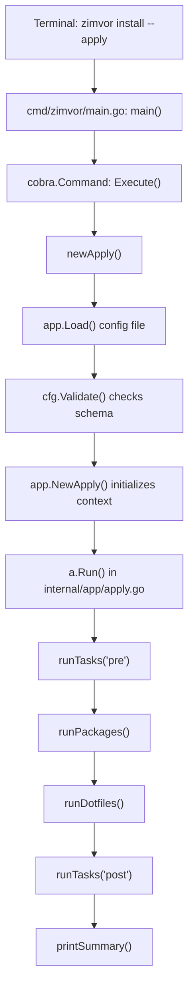

# Learning Go through Zimvor (Python Developer's Guide)

Welcome! This guide is designed for an experienced Python developer transitioning to Go. It maps out a structured learning path using this codebase and highlights the key differences, gotchas, and mental model shifts between Python and Go.

---

## 1. Go vs. Python: Key Mental Model Shifts

If you are coming from Python, Go will feel highly performant but syntactically strict. Here are the core concepts that work differently:

### 📂 File Structure & Package Scope (Crucial!)
* **Python:** Every `.py` file is a separate module. If `module_a.py` wants to use something in `module_b.py`, you *must* write `import module_b`.
* **Go:** Files in the same folder share a `package` declaration (e.g., `package app` in `internal/app/`). 
  * All files in `internal/app/` share the same namespace. 
  * `apply.go` can call `Confirm()` in `prompt.go` directly **without any imports**.
  * Packages are the boundary of compilation, not individual files.

### 🔒 Access Control (Public vs. Private)
* **Python:** Prefixes like `_method` or `__method` are conventions or name-mangled details indicating private members.
* **Go:** Visibility is determined purely by the **first letter's casing**:
  * **Capitalized (Uppercase):** Exported (Public) to other packages. E.g., `type Apply struct` in `app` can be imported and instantiated in `main`.
  * **Lowercase:** Unexported (Private) to the package. E.g., `type packageResult struct` can only be seen and used inside the `app` package.

### 🚫 Exceptions vs. Return Values
* **Python:** Errors are handled via exceptions: `try / except / raise`. Errors bubble up automatically.
* **Go:** Go does not have exceptions for normal error control (only `panic`, which is reserved for unrecoverable programmer errors like out-of-bounds array access).
  * Errors are standard returned values.
  * You will see the signature `func Load(...) (*Config, error)`.
  * You must check them explicitly: `if err != nil { return nil, err }`. 
  * *Tip:* Think of it as a pattern of validating boundaries immediately and bubbling up values explicitly.

### 🔗 Pointers (`*` and `&`)
* **Python:** Variables are references to objects. Reassigning variables or modifying lists modifies the underlying object in place.
* **Go:** Go defaults to passing by **value** (copying data).
  * If a function takes `cfg Config`, Go copies the entire struct. Modifying it inside the function doesn't affect the caller.
  * To modify variables, or to avoid copying large structs, Go uses **pointers**:
    * `*Config` means "pointer to a Config struct".
    * `&cfg` means "get the memory address of this cfg variable".
  * Methods can have pointer receivers: `func (a *Apply) Run()`. This allows `Run` to modify state inside `a`.

### 🧩 Classes vs. Structs & Interfaces
* **Python:** Object-oriented with classes, inheritance (`class Child(Parent)`), and dynamic duck typing.
* **Go:** No classes and **no inheritance**.
  * Code is modeled using **Structs** (data holders) and **Methods** (functions attached to structs).
  * Composition is used instead of inheritance (nesting structs inside structs).
  * **Interfaces** define behavior: `type Reader interface { Read() []byte }`. 
  * Go's interfaces are **implicitly satisfied**: if your struct implements `Read() []byte`, it automatically implements the `Reader` interface without needing an explicit `implements` keyword. This is type-safe "duck typing."

---

## 2. Zimvor's Execution Flow

To understand the codebase, trace how a command moves from typing it in the terminal to executing changes on your machine:

### Core Flow Details
1. **Entry Point:** [cmd/zimvor/main.go](file:///home/anorneto/DEV/simple-machine-setup/cmd/zimvor/main.go) compiles into the CLI binary. It uses the `cobra` library to manage CLI flags (`--apply`, `--yes`, `--config`).
2. **Orchestrator:** `newApply()` constructs the configuration context and creates an `app.Apply` struct.
3. **Phases:** [internal/app/apply.go](file:///home/anorneto/DEV/simple-machine-setup/internal/app/apply.go) coordinates the installation phases sequentially.

---

## 3. Recommended Learning Path

Follow this progression to build your Go skills using Zimvor:

### 🟦 Phase 1: Trace the Code (Read-Only)
* **Goal:** Understand Go's basic structures and packages.
* **Exercises:**
  1. Open [internal/app/platform.go](file:///home/anorneto/DEV/simple-machine-setup/internal/app/platform.go). See how it returns a string for the OS and a platform-specific filename.
  2. Open [internal/app/config.go](file:///home/anorneto/DEV/simple-machine-setup/internal/app/config.go). Look at the struct tags (e.g. ``toml:"meta"``) which tell the TOML parser how to map keys. Study the `Validate()` method to see how strings are trimmed and errors are collected.

### 🟩 Phase 2: Fix Core Correctness Bugs
* **Goal:** Learn standard library basics and process execution.
* **Exercises:**
  1. Fix **Improvement 1** in [packages.go](file:///home/anorneto/DEV/simple-machine-setup/internal/app/packages.go#L80): Replace `"which "` with `"command -v "` inside `statusPackages` to make check commands cross-platform.
  2. Fix **Improvement 2** in [exec.go](file:///home/anorneto/DEV/simple-machine-setup/internal/app/exec.go#L86): Correct `RunInteractive` by assigning standard input/output streams (`os.Stdin`, `os.Stdout`, `os.Stderr`) to `exec.Cmd`. Run tests using `go test -v ./internal/app/...` to verify your changes did not break the dry-run behavior.

### 🟨 Phase 3: Write Integration Tests
* **Goal:** Learn how to write tests in Go using standard library tools.
* **Exercises:**
  1. Study [internal/app/config_test.go](file:///home/anorneto/DEV/simple-machine-setup/internal/app/config_test.go) to see how simple unit tests are structured.
  2. Implement **Improvement 6**: Write a test in `internal/app/integration_test.go` (or `apply_test.go`) that mocks a user home directory and config directory using `t.TempDir()`. Write a fake configuration TOML to it, run `Apply.Run()`, and verify the final filesystem state.

### 🟥 Phase 4: Refactor using SOLID Principles
* **Goal:** Master Go Interfaces, Dependency Inversion, and advanced parsing.
* **Exercises:**
  1. Implement **Improvement 3**: Create a `UI` interface to decouple the colored lipgloss print statements from the installation logic. Pass this interface into `Apply`.
  2. Implement **Improvement 5**: Use `toml.NewDecoder` and inspect `metadata.Undecoded()` to flag invalid keys in configs, protecting users from typos.

---

## 4. Go Gotas for Python Developers

Keep these behaviors in mind as you write Go:

* **Slices vs. Lists:** Go "Slices" (like `[]string`) look like Python Lists, but they are wrappers around fixed-size arrays. Reallocating or slicing them behaves differently. Modifying a slice element in a function usually affects the array, but appending to it inside a function will not affect the caller's slice unless you pass a pointer or return the new slice.
* **The Zero Value:** Go has no `None` (except for pointers, interfaces, and maps which can be `nil`). Variables declared without an explicit initial value get a default **Zero Value** (`""` for strings, `0` for numbers, `false` for booleans, empty structs for struct types).
* **Variable Shadowing:** Using the short variable declaration operator `:=` inside an `if` or `for` block can accidentally create a new local variable that "shadows" an outer variable of the same name.
* **`defer` Statements:** Go's `defer` schedules a function call to run immediately before the surrounding function returns. It is often used to close files or clean up locks, similar to Python's `with` statement.
